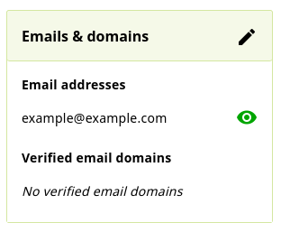
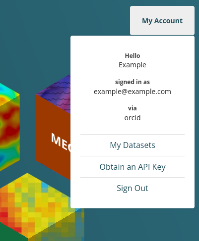

# ORCID Logins

OpenNeuro supports account creation with [ORCID](https://orcid.org/). Creating an ORCID iD allows you to login to OpenNeuro, associate works with your profile, and gives OpenNeuro users interacting with datasets a mechanism to contact you or source your activity on OpenNeuro (datasets, comments, etc). OpenNeuro also displays your published name or given name on datasets you have uploaded or modified, and comments. In the future, related datasets discoverable via ORCID may be shown using your ORCID iD and name.

## Enabling Trusted Access to Emails

To use all features of OpenNeuro, you must make at least one email address available to OpenNeuro from your ORCID profile. The first email visible to OpenNeuro will be used for email notifications on your dataset and allows other users to grant you permissions on their datasets by entering this email address. OpenNeuro requires a minimum of trusted institutional access.

Visit [your ORCID profile](https://orcid.org/my-orcid) and add or modify an email.

Ensure that at least one email address is visible to everyone or trusted parties, and has been verified with ORCID.

Sign out and reauthenticate with OpenNeuro to update your OpenNeuro account after any email changes on your ORCID profile.

## Migration of Google Accounts to ORCID

OpenNeuro previously allowed registration of accounts with Google. In May of 2025, we began migrating accounts to use ORCID for all logins.

If you created a Google registered account on OpenNeuro before this date, you can login and migrate it to an associated ORCID registered OpenNeuro account. If you already had both a Google and ORCID registered account, doing this will merge all contributions from both accounts into one accessed with your ORCID login. This step is irreversible, make sure to use an appropriate ORCID account during this linking step.

If you had multiple Google accounts, you can merge their content into one ORCID registered OpenNeuro account. Login with each Google account and repeat the linking steps for ORCID and all contributions will be assigned to your ORCID account.

If you encounter issues with the merged account, please open a support request and include the email of the Google account used and the ORCID iD of the ORCID account used.