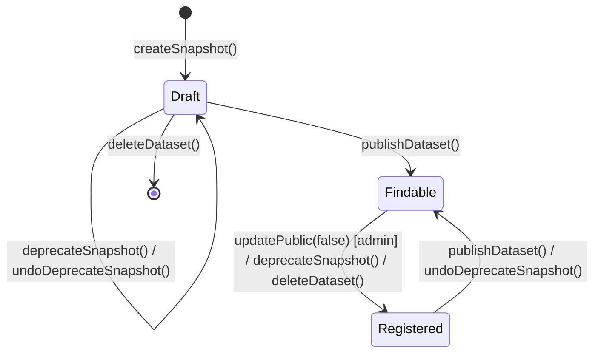

# DOI Lifecycle State Management — Design Spec

**Date**: 2026-04-06
**Status**: Drafted

## 1. Problem Statement

OpenNeuro mints DOIs for every snapshot via DataCite's legacy MDS API. The current implementation has three problems:

1. **DOIs are immediately findable.** A snapshot on an embargoed (private) dataset gets a DOI that is discoverable in DataCite search, leaking the existence of unreleased data.

2. **DOI state is never updated after creation.** Publishing, deprecating, re-embargoing, or deleting a dataset has no effect on its DOIs at DataCite. A deleted dataset's DOIs remain findable indefinitely.

3. **Deletion is unnecessarily restrictive.** Any dataset with snapshots requires admin intervention to delete, even when all DOIs are still in draft state and can be cleanly removed from DataCite.

The `Doi` model (`packages/openneuro-server/src/models/doi.ts`) stores `{ datasetId, snapshotId, doi }` with no state tracking. The DOI creation code (`packages/openneuro-server/src/libs/doi/index.ts`) uses the MDS API, which does not support state transitions.

## 2. Design Goals

- **Align DOI discoverability with dataset visibility.** Embargoed datasets get draft DOIs; public datasets get findable DOIs; deprecated snapshots get registered (resolvable but not discoverable) DOIs.
- **Fail fast on metadata issues.** Create DOIs in draft state at snapshot time so invalid metadata is caught before the git tag is created.
- **Reduce admin burden.** Let owners delete their own embargoed datasets when all DOIs are still draft.
- **Migrate existing DOIs.** Backfill state for all existing DOI records and reconcile with DataCite.
- **Handle DataCite failures gracefully.** Detect and recover from state divergence between the local database and DataCite.

## 3. Architecture

### System components

DOI state management spans three layers:

| Layer             | Component                                                           | Role                                   |
| ----------------- | ------------------------------------------------------------------- | -------------------------------------- |
| GraphQL resolvers | `packages/openneuro-server/src/graphql/resolvers/publish.ts` et al. | Entry points for lifecycle mutations   |
| Dataset service   | `packages/openneuro-server/src/datalad/dataset.ts`                  | Orchestrates dataset state changes     |
| DOI service       | `packages/openneuro-server/src/libs/doi/index.ts`                   | Communicates with DataCite API         |
| Snapshot service  | `packages/openneuro-server/src/datalad/snapshots.ts`                | Creates snapshots and mints draft DOIs |
| DOI model         | `packages/openneuro-server/src/models/doi.ts`                       | MongoDB persistence for DOI records    |
| Datalad service   | `services/datalad/datalad_service/tasks/publish.py`                 | S3/GitHub export on publish            |
| Datalad snapshots | `services/datalad/datalad_service/tasks/snapshots.py`               | Git tag creation                       |

### Key change: MDS API to REST API

The current DOI code uses DataCite's MDS API (XML metadata, `PUT /doi`). DOI state transitions (`publish`, `register`, `hide`) require the REST API (`POST/PUT https://api.datacite.org/dois` with JSON payloads). This is the most significant infrastructure change.

### Data flow

DOI side effects are injected into existing mutation handlers. No new mutations are added. The DOI service gains three new operations: `publishDoi()`, `hideDoi()`, and `deleteDoi()`, corresponding to DataCite REST API events.

## 4. DOI State Model

DataCite defines three DOI states:

| DOI State      | Resolvable | Discoverable | Deletable | When used                                     |
| -------------- | ---------- | ------------ | --------- | --------------------------------------------- |
| **Draft**      | No         | No           | Yes       | Embargoed dataset (any snapshot status)       |
| **Registered** | Yes        | No           | No        | Public + deprecated snapshot, or re-embargoed |
| **Findable**   | Yes        | Yes          | No        | Public dataset, active snapshot               |

### State mapping: dataset lifecycle x snapshot status to DOI state

| Dataset lifecycle        | Snapshot status | DOI state  |
| ------------------------ | --------------- | ---------- |
| Embargoed                | Active          | Draft      |
| Embargoed                | Deprecated      | Draft      |
| Public                   | Active          | Findable   |
| Public                   | Deprecated      | Registered |
| Embargoed (was Public)   | Active          | Registered |
| Embargoed (was Public)   | Deprecated      | Registered |
| Deleted (all DOIs draft) | --              | Deleted    |
| Deleted (any non-draft)  | --              | Registered |

### State diagram

### Transition table

| Trigger                                  | DataCite event | DOI transition               |
| ---------------------------------------- | -------------- | ---------------------------- |
| `publishDataset()`                       | `publish`      | Draft/Registered -> Findable |
| `updatePublic(false)`                    | `hide`         | Findable -> Registered       |
| `deprecateSnapshot()` (if Public)        | `hide`         | Findable -> Registered       |
| `deprecateSnapshot()` (if Embargoed)     | --             | stays Draft                  |
| `undoDeprecateSnapshot()` (if Public)    | `publish`      | Registered -> Findable       |
| `undoDeprecateSnapshot()` (if Embargoed) | --             | stays Draft                  |
| `deleteDataset()` (draft DOIs)           | DELETE         | Draft -> Deleted             |
| `deleteDataset()` (findable DOIs)        | `hide`         | Findable -> Registered       |
| `deleteDataset()` (registered DOIs)      | --             | stays Registered             |

## 5. Mutation Side Effects

For each GraphQL mutation that now requires DOI side effects:

| Mutation                | Current behavior                  | New DOI side effect                                                                                          | Scope      |
| ----------------------- | --------------------------------- | ------------------------------------------------------------------------------------------------------------ | ---------- |
| `createSnapshot`        | Mints DOI via MDS API (findable)  | Create DOI in **draft** via REST API. If dataset is already public, immediately transition to **findable**.  | Single DOI |
| `publishDataset`        | Sets `public=true`, exports to S3 | Call `publish` on all snapshot DOIs. Update local state to **findable**.                                     | All DOIs   |
| `updatePublic(false)`   | Sets `public=false`               | Call `hide` on all snapshot DOIs. Update local state to **registered**.                                      | All DOIs   |
| `deprecateSnapshot`     | Creates DeprecatedSnapshot doc    | If dataset is public: call `hide` on this snapshot's DOI, set state to **registered**. If embargoed: no-op.  | Single DOI |
| `undoDeprecateSnapshot` | Removes DeprecatedSnapshot doc    | If dataset is public: call `publish` on this snapshot's DOI, set state to **findable**. If embargoed: no-op. | Single DOI |
| `deleteDataset`         | Removes dataset                   | For draft DOIs: DELETE at DataCite. For findable DOIs: `hide`. For registered DOIs: no-op.                   | All DOIs   |
| `createDataset`         | Creates empty dataset             | No DOI side effect.                                                                                          | --         |

Side effects execute **after** the primary mutation succeeds but **within the same logical operation**. A DataCite failure on `createSnapshot` is fatal (snapshot creation rolls back). DataCite failures on other mutations are logged and queued for retry (see section 8).

## 6. Deletion Permissions

The new rule: dataset owners can delete if all associated DOIs are in draft state. Admin is required when any DOI has left draft.

| Dataset state | DOI state of snapshots  | Who can delete | DOI action at DataCite        |
| ------------- | ----------------------- | -------------- | ----------------------------- |
| Draft         | No snapshots exist      | Owner          | N/A                           |
| Embargoed     | All DOIs in draft       | Owner          | DELETE all DOIs               |
| Any           | Any registered/findable | Admin only     | `hide` findable -> registered |

**Implementation**: The `deleteDataset()` function in `packages/openneuro-server/src/datalad/dataset.ts` currently checks for admin permissions when snapshots exist. This check changes to: query the `Doi` collection for any records with `state != "draft"` for the dataset. If none found, owner permission suffices. If any found, require admin.

## 7. Migration

### Scope

All existing `Doi` records lack a `state` field. Based on the legacy MDS API behavior, all existing DOIs are expected to be in **findable** state at DataCite.

### Migration steps

1. **Add `state` field to Doi model** with no default (allows distinguishing migrated from unmigrated records).
2. **Query DataCite REST API** for each existing DOI to confirm its actual state.
3. **Update local records** with the state reported by DataCite.
4. **Flag discrepancies** -- any DOI not found at DataCite or in an unexpected state is logged for manual review.
5. **For deleted datasets** that still have DOI records: if the DOI is findable at DataCite, transition it to registered via `hide`.

### Execution

- Run as a one-time script against the production database.
- Dry-run mode first: report what would change without writing.
- Rate-limit DataCite API calls to avoid hitting quotas.
- Expected volume: one API call per existing DOI record. The DataCite REST API supports bulk lookup but individual GETs are simpler to implement and debug.

### Rollback

The migration only adds data (the `state` field). Rolling back means removing the field. No existing data is modified or deleted.

## 8. Error Handling

### DataCite unavailable

| Scenario                                   | Behavior                                                                 |
| ------------------------------------------ | ------------------------------------------------------------------------ |
| DataCite down during `createSnapshot`      | **Fatal.** Snapshot creation fails. No git tag created. User sees error. |
| DataCite down during `publishDataset`      | **Non-fatal.** Dataset publishes. DOI transition queued for retry.       |
| DataCite down during `deleteDataset`       | **Non-fatal.** Dataset deleted locally. DOI cleanup queued for retry.    |
| DataCite down during deprecate/undeprecate | **Non-fatal.** Local state updated. DOI transition queued for retry.     |

Rationale: `createSnapshot` is fatal because the DOI string must be embedded in `dataset_description.json` before the git tag. All other mutations have a primary effect (visibility change, deletion) that should not be blocked by a DOI service outage.

### Metadata validation failure

DataCite rejects DOI creation if required metadata is missing (e.g., no creators). This fails the `createSnapshot` call with a descriptive error. The user must fix metadata before retrying.

### Local/remote state divergence

A reconciliation job should run periodically (e.g., daily cron) to:

1. Query all local `Doi` records.
2. Compare local `state` with DataCite's reported state.
3. Log any mismatches.
4. Optionally auto-correct by issuing the appropriate DataCite event to match the expected state derived from the dataset lifecycle + snapshot status mapping.

This handles edge cases like a `hide` call that succeeded at DataCite but failed to update MongoDB, or manual DataCite console changes.

### Retry strategy

Failed non-fatal DOI transitions are stored in a retry queue (e.g., a MongoDB collection or Redis list). A background worker retries with exponential backoff, capped at 6 retries over 24 hours. After exhausting retries, the failure is escalated to admin review.

## 9. Testing Strategy

### Unit tests

- **State transition logic**: Given (dataset lifecycle, snapshot status), assert the correct DOI state and DataCite event. Cover all cells in the state mapping table.
- **Deletion permission logic**: Given a set of DOI states for a dataset, assert whether owner or admin permission is required.
- **No DataCite calls for embargoed deprecate/undeprecate**: Verify that no API call is made when the dataset is not public.

### Integration tests (DataCite test environment)

DataCite provides a test API at `https://api.test.datacite.org`. Integration tests should:

- Create a DOI in draft state and verify it is not resolvable.
- Transition draft -> findable via `publish` and verify discoverability.
- Transition findable -> registered via `hide` and verify it resolves but is not discoverable.
- Delete a draft DOI and verify it no longer exists.
- Attempt to delete a registered DOI and verify it fails.
- Submit invalid metadata and verify the error response.

### Migration dry-run

- Run the migration script in dry-run mode against a staging database with production data.
- Verify that all DOI records receive a state matching DataCite's reported state.
- Verify that DOIs not found at DataCite are flagged, not silently skipped.

### End-to-end smoke tests

- Full lifecycle: create dataset -> snapshot -> publish -> deprecate snapshot -> undeprecate -> re-embargo -> delete. Verify DOI state at each step matches the state mapping table.

## 10. Open Questions

The lifecycle document resolved the major design decisions. Remaining implementation-level questions:

1. **Retry infrastructure**: Use an existing job queue (if one exists in the codebase) or add a new retry mechanism? This is an implementation choice, not a design decision.

2. **Reconciliation frequency**: Daily reconciliation is suggested, but the appropriate interval depends on operational experience with DataCite reliability.

3. **`publishDate` bug**: The lifecycle doc notes that `updatePublic(false)` overwrites `publishDate` with the current date rather than clearing it (Gap 4). Should this be fixed as part of this work or tracked separately?
